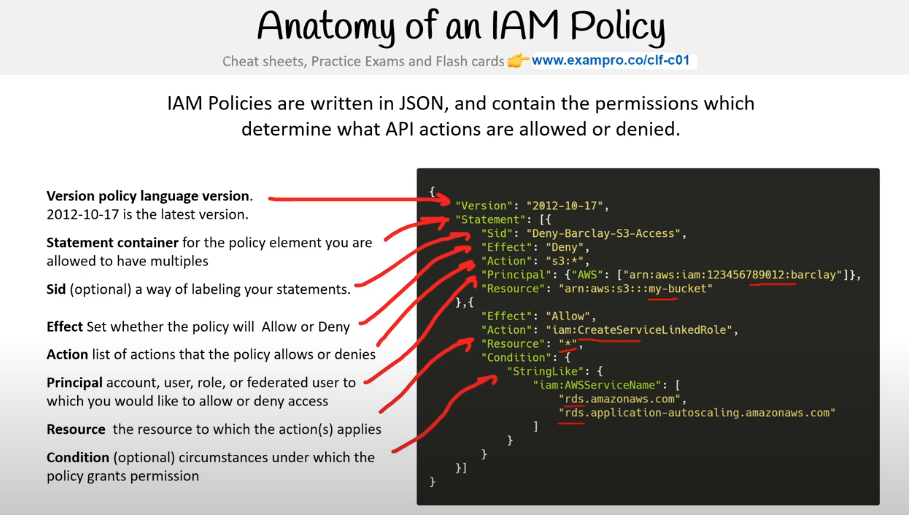
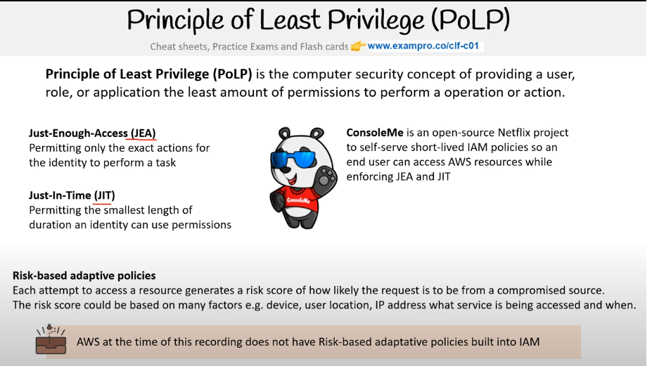

## Convert to json

The command
```sh
yq -o json policy.yml > policy.json
```

The bash script

```sh
./convert
```

# Create  IAM Policy

```sh
aws iam create-policy \
--policy-name my-fun-policy \
--policy-document file://policy.json
```

# Attach Policy to user

```sh
aws iam attach-user-policy \
--policy-arn arn:aws:iam::982383527471:policy/my-fun-policy  \
--user-name aws-examples
```

# Anatomy of an IAM policy



# Principle of least privilege (PoLP)
Is an operation that consist of giving the least amount of permission to a user to perform an action or an operation.



