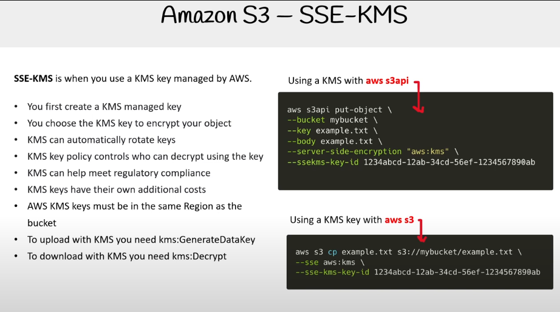

## S3 encryption overview

- encryption in transit
when the data is encrypted by the sender and decrypt by the receiver
- Encryption at rest
* client side encryption (CSE)
when the the data is encrypt by the client and then send to the server
* server side encryption (SSE)
When the data is encrypter by the server.

## Create a bucket

aws s3 mb s3://encryption-fun-fd

### Create a file and Put Object with encrpytion SS3-S3

echo "Hello Francklin" > hello.txt
aws s3 cp hello.txt  s3://encryption-fun-fd

### Put Object with encryption of SS3-KMS

aws s3api put-object \
--bucket encryption-fun-fd \
--key hello.txt \
--body hello.txt \
--server-side-encryption "aws:kms" \
--ssekms-key-id "a1bb2b48-ce90-49ff-bd06-f23705bcc0d8" # do this to get this output: aws kms list-buckets

### Put Object with SSE-C [Failed Attempt]

export BASE64_ENCODED_KEY=$(openssl rand -base64 32)
echo  $BASE64_ENCODED_KEY

export MD5_VALUE=$(echo $BASE64_ENCODED_KEY | md5sum | awk '{print $1}' | base64 -w0)
echo  $MD5_VALUE

aws s3api put-object \
--bucket encryption-fun-fd \
--key hello.txt \
--body hello.txt \
--sse-customer-algorithm AES256 \
--sse-customer-key $BASE64_ENCODED_KEY \
--sse-customer-key-md5 $MD5_VALUE

An error occurred (InvalidArgument) when calling the PutObject operation: The calculated MD5 hash of the key did not match the hash that was provided.

### Put Object with SSE-C via aws s3

https://catalog.us-east-1.prod.workshops.aws/workshops/aad9ff1e-b607-45bc-893f-121ea5224f24/en-US/s3/serverside/ssec

openssl rand -out ssec.key 32

aws s3 cp hello.txt s3://encryption-fun-fd/hello.txt \
--sse-c AES256 \
--sse-c-key fileb://ssec.key

aws s3 cp s3://encryption-fun-fd/hello.txt hello.txt --sse-c AES256 --sse-c-key fileb://ssec.key

## delete bucket